# Athanor Mission Control — wireframes

Wireframes of the dashboard UI (`athanor dashboard`, and the baked static twin
from `athanor export-pages`). These are **descriptive, not aspirational**:
every box, label, and number below is traced from the shipped implementation,
so this doubles as a spec to review changes against.

The figures are hand-written SVG in [`docs/wireframes/`](docs/wireframes/) —
one file per figure, self-contained, no build step and no dependencies, the
same rule the UI itself follows. Colours are the shipped tokens from
`app.css`, so a wireframe and a screenshot should be the same picture.

Source of truth for each region:

| Layer | File |
|---|---|
| Structure (cards, pages, ids) | [`src/athanor/web/index.html`](src/athanor/web/index.html) |
| Layout, tokens, states | [`src/athanor/web/app.css`](src/athanor/web/app.css) |
| Content, data binding, SVG | [`src/athanor/web/app.js`](src/athanor/web/app.js) |
| Endpoints (`/api/snapshot`, `/api/benchmark`) | [`src/athanor/dashboard.py`](src/athanor/dashboard.py) |

The UI is **read-only by design** — no control writes back to the campaign.
Changing what a mission targets is a `config/mission.yaml` edit, never a
click.

### Figures

| § | Figure |
|---|---|
| 0 | [legend](docs/wireframes/00-legend.svg) |
| 1 | [frame — global chrome](docs/wireframes/01-frame.svg) |
| 2 | [page ① campaign, full layout](docs/wireframes/02-campaign-page.svg) |
| 3.1–3.3 | [mission](docs/wireframes/03-mission-card.svg) · [campaign](docs/wireframes/04-campaign-card.svg) · [agent & critic](docs/wireframes/05-agent-critic-card.svg) |
| 3.4 | [discovery loop](docs/wireframes/06-discovery-loop.svg) |
| 3.5 | [composition map](docs/wireframes/07-composition-map.svg) |
| 3.6–3.8 | [agent feed](docs/wireframes/08-agent-feed.svg) · [top candidates](docs/wireframes/09-top-candidates.svg) · [notebook panel](docs/wireframes/10-notebook-panel.svg) |
| 4–5 | [page ② benchmark](docs/wireframes/11-benchmark-page.svg) · [page ③ notebook](docs/wireframes/12-notebook-page.svg) |
| 6 | [states](docs/wireframes/13-states.svg) |
| 7 | [responsive ≤ 980px](docs/wireframes/14-responsive.svg) |

---

## 0. Legend

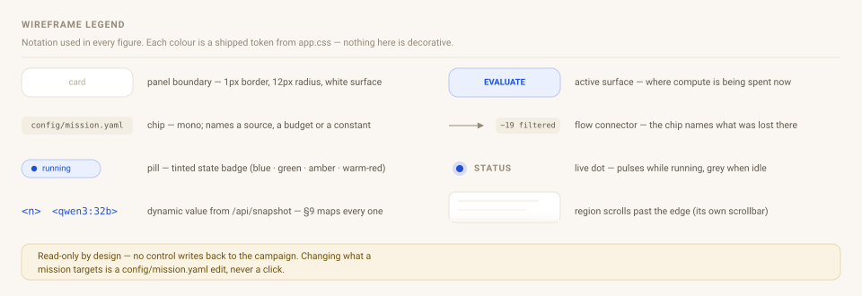

Anything in `<…>` comes from `/api/snapshot`; §9 maps each one to its JSON
field.

---

## 1. Frame — global chrome

Present on all three pages. Header and status bar are `flex-wrap: wrap`, so
they reflow rather than clip on narrow viewports.

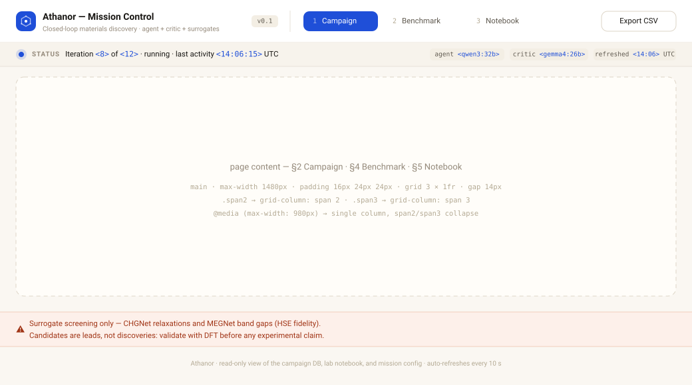

Notes

- **Brand mark** — 30px rounded square, `--primary` fill, inline SVG
  hexagon + four nodes (the closed loop, abstracted). No raster assets.
- **Page pills** — radio-style; the active one is solid `--primary`. The
  numeral is mono and dimmed. Switching pages only toggles `hidden` on the
  three `<main>` elements; no route, no reload.
- **Export CSV** is pushed right by `margin-left:auto` and is the only
  control that produces output — a client-side Blob of every candidate row
  (`iteration, formula, band_gap_ev, e_above_hull,
  formation_energy_per_atom, converged, is_novel, hit, rediscovery`).
- **Disclaimer bar** is warm-red (`--warn-*`) and never dismissible. It is
  the scientific-honesty guardrail, not a notification.

### Page grid

```
main : max-width 1480px · padding 16px 24px 24px · grid 3 × 1fr · gap 14px
       ├ .span2 → grid-column: span 2
       └ .span3 → grid-column: span 3
@media (max-width: 980px) → single column; span2/span3 collapse to span 1
```

---

## 2. Page ① Campaign — full desktop layout

The default view. Four rows; read top-left → bottom-right as *what we're
looking for → how far we've got → how the loop is running → what it found*.

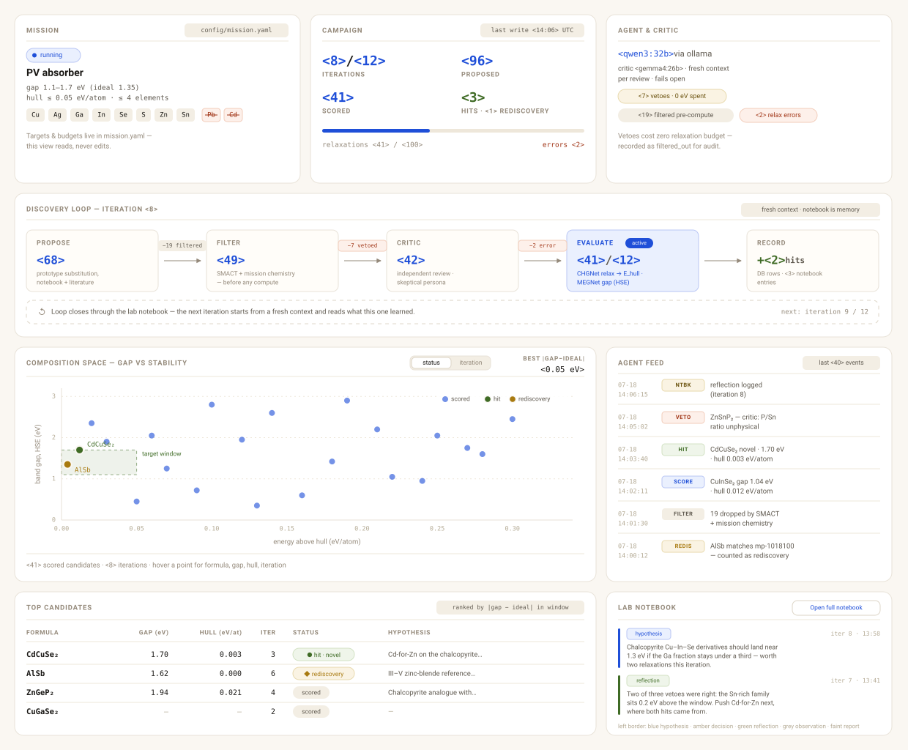

---

## 3. Component detail

### 3.1 Mission card

Static per campaign — it exists so a reader can judge every number on the
page against the target that produced it.

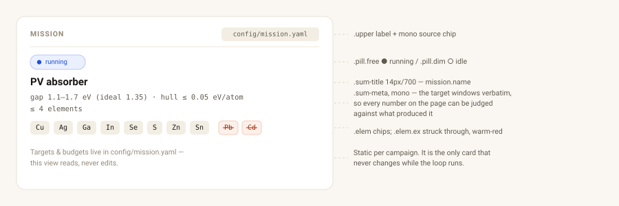

### 3.2 Campaign card

Four stats in a 2×2 grid, then the budget meter. `HITS` is the only stat
that takes a color (`--hit` green) — the page has exactly one number that
means *success*, and this is it.

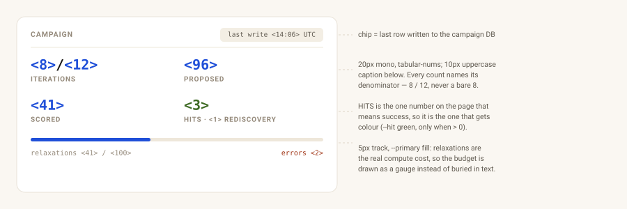

The meter is the compute-honesty gauge: relaxations are the real cost, so
the budget is drawn as a bar rather than buried in text.

### 3.3 Agent & critic card

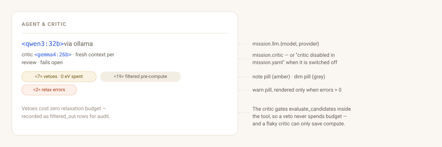

### 3.4 Discovery loop (pipeline strip)

The centerpiece: one horizontal funnel for the **latest** iteration, with
the loss at each step named on the connector. `.pipe-scroll` scrolls
horizontally below `min-width: 820px` rather than squashing the stages.

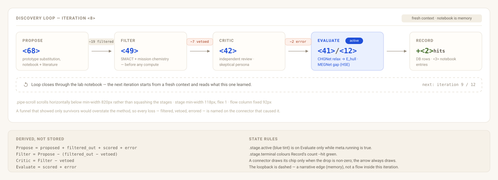

State rules

- `.stage.active` (blue tint + blue ink) is on **Evaluate** only while
  `meta.running` is true — it marks where compute is being spent right now.
- `.stage.terminal` colors Record's count `--hit` green.
- A connector renders its chip only when the drop is non-zero; the arrow
  always renders. Evaluate → Record has no chip by construction.
- Counts are derived, not stored: `Propose = proposed + filtered_out +
  scored + error`, `Filter = Propose − (filtered_out − vetoed)`,
  `Critic = Filter − vetoed`, `Evaluate = scored + error`.
- The loopback strip is dashed, not solid — it is a *narrative* edge
  (memory via notebook), not a data flow inside this iteration.

### 3.5 Composition map

A hand-rolled SVG scatter — `viewBox="0 0 860 480"`, margins L64 R24 T20
B60, `preserveAspectRatio="none"` so it fills the card at any width.

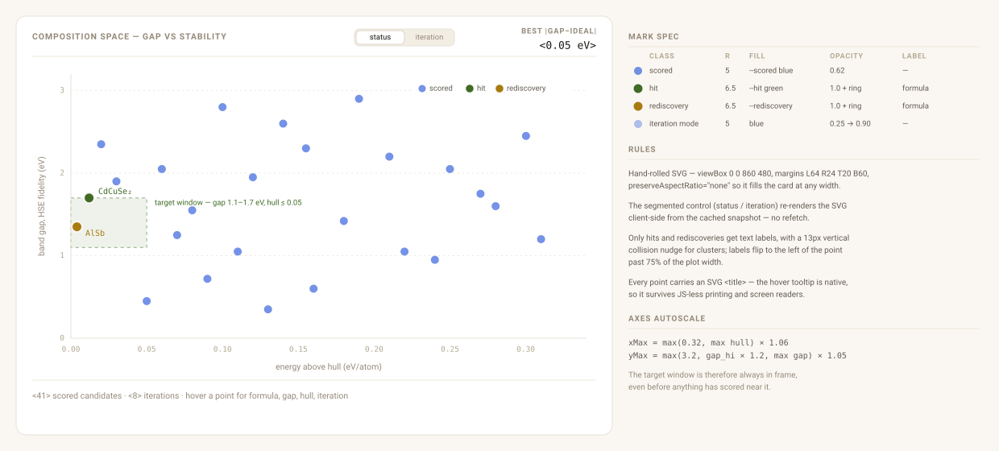

Mark spec

| Class | Radius | Fill | Opacity | Label |
|---|---|---|---|---|
| scored | 5 | `--scored` blue | 0.62 | — |
| hit | 6.5 | `--hit` green | 1.0, 2px cream ring | formula, mono 10.5px |
| rediscovery | 6.5 | `--rediscovery` amber | 1.0, 2px cream ring | formula |
| *iteration mode* | 5 | blue | 0.25 → 0.90 by iteration | — |

- The **segmented control** (`status` / `iteration`) re-renders the SVG
  client-side from the cached snapshot; no refetch.
- Only hits and rediscoveries get text labels, with a 13px vertical
  collision nudge for clusters; labels flip to the left of the point past
  75% of the plot width.
- Every point carries an SVG `<title>` — the hover tooltip is native, so it
  survives with JS-less printing and screen readers.
- Axes autoscale: `xMax = max(0.32, max hull) × 1.06`,
  `yMax = max(3.2, gap_hi × 1.2, max gap) × 1.05` — the target window is
  always in frame even before anything scores near it.

### 3.6 Agent feed

Fixed 3-column grid (`82px · 88px · 1fr`), newest first, `max-height:
430px`, own scroll.

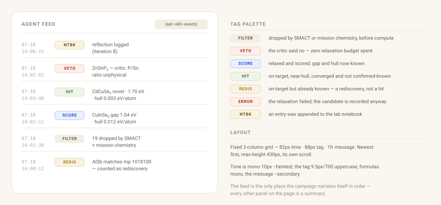

Tag palette: `filtered` neutral · `veto` warm-red · `score` blue ·
`hit` green · `rediscovery` amber · `error` warm-red · `notebook` sand.

### 3.7 Top candidates table

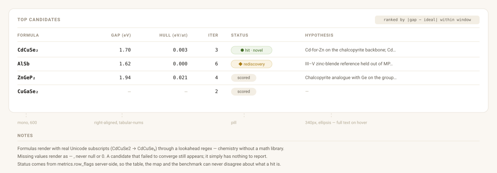

Formulas are rendered with real Unicode subscripts (`CdCuSe2 → CdCuSe₂`)
by a lookahead regex, so they read as chemistry without a math library.
Missing values render as `—`, never `null` or `0`.

### 3.8 Lab notebook panel

Last four entries, newest first, each clamped to three lines. The left
border encodes entry type.

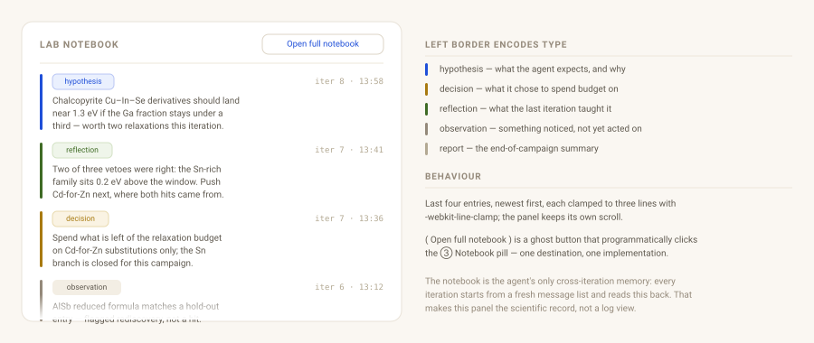

`Open full notebook` is a ghost button that programmatically clicks the
③ Notebook pill — one destination, one implementation.

---

## 4. Page ② Benchmark

A single full-width card. Columns are read from the JSON rather than
hard-coded, so a new metric in `benchmark.py` appears here with no UI
change.

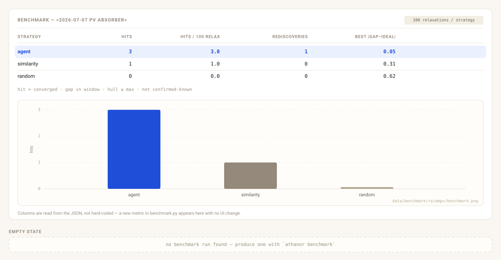

---

## 5. Page ③ Notebook

The full scientific record, newest first, unclamped — the same entry
component as §3.8 with `-webkit-line-clamp` removed and no height cap.

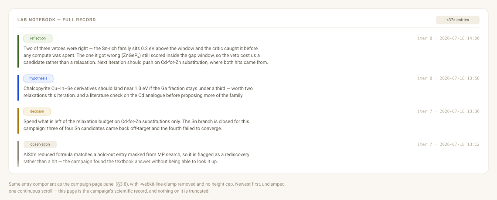

---

## 6. States

Every panel has an explicit empty state; none of them is a spinner. The
dashboard is usable — and honest — before a single candidate exists.

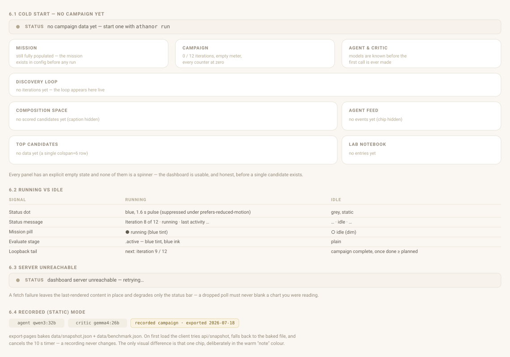

### 6.1 Cold start (no campaign yet)

The mission card is still fully populated — the mission exists in config
before any run — and so is the agent card, because the models are known
before the first call is ever made. Everything downstream of compute says
so plainly: `no iterations yet`, `no scored candidates yet`, `no events
yet`, `no data yet`, `no entries yet`.

### 6.2 Running vs idle

| Signal | Running | Idle |
|---|---|---|
| Status dot | blue, 1.6s pulse (suppressed under `prefers-reduced-motion`) | grey, static |
| Status message | `Iteration 8 of 12 · running · last activity …` | `… · idle · …` |
| Mission pill | `● running` (blue tint) | `○ idle` (dim) |
| Evaluate stage | `.active` blue tint | plain |
| Loopback tail | `next: iteration 9 / 12` | `campaign complete` when done ≥ planned |

### 6.3 Server unreachable

Fetch failure leaves the last-rendered content in place and degrades only
the status bar — a dropped poll must never blank a chart you were reading.

### 6.4 Recorded (static) mode

`export-pages` bakes `data/snapshot.json` + `data/benchmark.json`. On first
load the client tries `api/snapshot`, falls back to the baked file, and
**cancels the 10s timer** — a recording never changes. The only visual
difference is one chip, and it is deliberately the warm "note" color.

---

## 7. Responsive — ≤ 980px

Single column, source order preserved. The pipeline keeps its 820px
min-width and scrolls horizontally inside its card; the table and the
benchmark table do the same. Nothing reflows into a different reading
order, and no content is hidden at any width.

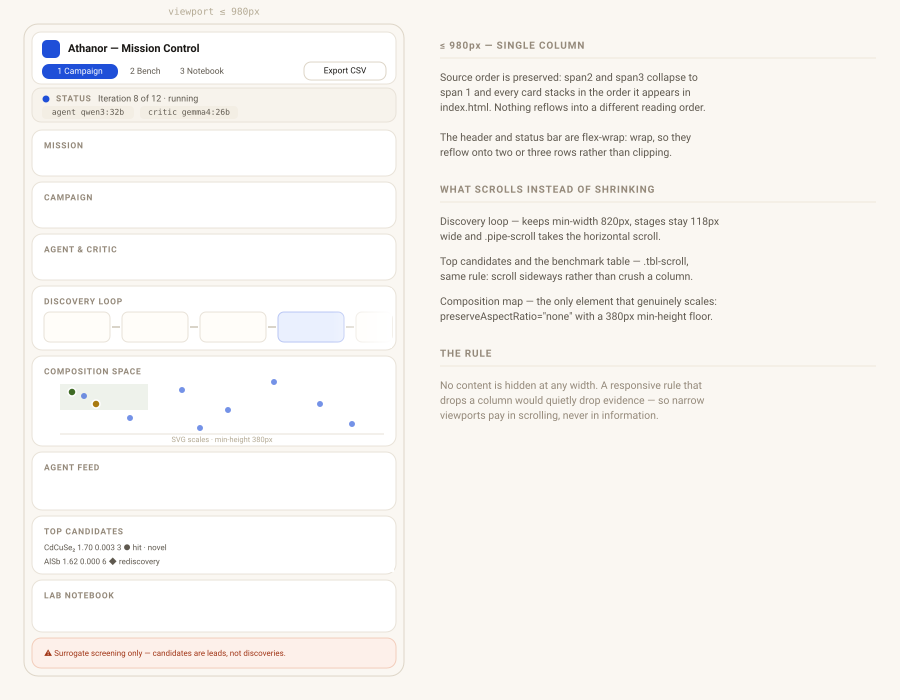

---

## 8. Interaction map

The whole surface has five interactions. That is the design: it is an
instrument panel, not an app.

| Control | Effect |
|---|---|
| ① / ② / ③ page pill | toggles `main[hidden]`; ② lazily fetches the benchmark |
| `status` \| `iteration` segment | re-renders the map SVG from the cached snapshot (no network) |
| Export CSV | client-side Blob download of all candidate rows |
| Open full notebook | clicks the ③ pill |
| hover a point / a hypothesis cell | native tooltip (SVG `<title>` / `title` attribute) |

Plus one automatic behaviour: `setInterval` 10 s → `GET api/snapshot` →
`renderAll()`, cancelled in recorded mode.

Keyboard/a11y: all controls are real `<button>`s with a visible
`:focus-visible` ring; cards carry `aria-label`s; the map exposes
`role="img"` with a descriptive label; the pulse respects
`prefers-reduced-motion`.

---

## 9. Data binding

Every dynamic slot above, and where it comes from in `/api/snapshot`.

| Region | DOM id | Snapshot path |
|---|---|---|
| Status message | `status-msg` | `meta.running`, `meta.last_activity`, `iterations[-1].iteration`, `mission.budget.iterations` |
| Status chips | `status-chips` | `mission.llm.model`, `mission.critic.*`, `meta.generated_at` |
| Mission card | `mission-card` | `mission.{name,band_gap_ev,band_gap_ideal_ev,e_above_hull_max,max_elements,allowed_elements,excluded_elements}` |
| Campaign stats | `campaign-card` | `totals.{iterations_done,proposed,scored,hits,rediscoveries,relaxations_used,relaxations_budget,errors}` |
| Agent & critic | `agent-card` | `mission.llm`, `mission.critic`, `totals.{vetoed,filtered_out,errors}` |
| Pipeline | `pipeline` | `iterations[-1].{proposed,filtered_out,vetoed,scored,error}`, `candidates[].flags.hit`, `notebook[].iteration` |
| Map | `map` | `candidates[].{formula,band_gap_ev,e_above_hull,iteration,is_novel,flags}`, `mission.band_gap_ev`, `mission.e_above_hull_max` |
| Best-gap stat | `best-gap` | `totals.best_gap_distance` |
| Feed | `feed` | `feed[].{when,kind,formula,text}` |
| Top table | `top-body` | `top[].{formula,band_gap_ev,e_above_hull,iteration,flags,is_novel,hypothesis}` |
| Notebook | `notebook-panel`, `notebook-full` | `notebook[].{type,iteration,when,text}` |
| Benchmark | `bench-body` | `/api/benchmark`: `{available,title,budget,rows,hit_definition,has_plot}` |

`flags.hit` / `flags.rediscovery` are computed server-side by
`metrics.row_flags` — the UI never re-derives the hit rule, so dashboard,
benchmark table, and paper always agree.

---

## 10. Token reference

Colors live only in the `:root` block of `app.css`; nothing below is
duplicated in markup, and the figures in `docs/wireframes/` use these same
values verbatim.

```
surfaces   --page-bg #faf7f2   --surface #ffffff   --raised #fffdf9
           --muted   #f7f3ec   --chip-bg #f3eee4   --group-bg #f6f1e8
lines      --border  #e8e2d8   --control #ddd5c7   --subtle  #eee7da
ink        --ink #191714  --secondary #5f594f  --faint #94897a  --faintest #b3a993
primary    --primary #1f4fd8  (hover #1a41b4, tint bg #eaf0fe, tint border #b9c6f4)
semantic   --hit #3f6b25 (green)   --rediscovery #a87a10 (amber)
           ok / note / warn triples for pill + chip backgrounds
type       IBM Plex Sans (variable) + IBM Plex Mono, both bundled — no CDN
scale      --fz-micro 10–11.5px · --fz-small 11.5–13px · --fz-body 12.5–14px
           · --fz-large 14–16px  (all clamp()-fluid)
```

Design rules the wireframes encode:

1. **One accent for identity, two for meaning.** Blue is the product;
   green means *hit*, amber means *rediscovery*. Nothing else earns color.
2. **Numbers are mono and tabular** everywhere they can be compared down a
   column.
3. **Every count names its denominator** — `41 / 100 relaxations`,
   `8 / 12 iterations`. A number without a budget beside it is a number
   that can mislead.
4. **Losses are labeled, not hidden.** Filtered, vetoed, and errored
   candidates appear on the pipeline connectors, because a funnel that only
   shows survivors overstates the method.
5. **No build step.** Vanilla JS, hand-written SVG, bundled fonts, zero
   dependencies — the UI ships inside the Python package, mirroring the
   stdlib-only server. These wireframes are hand-written SVG for the same
   reason.
